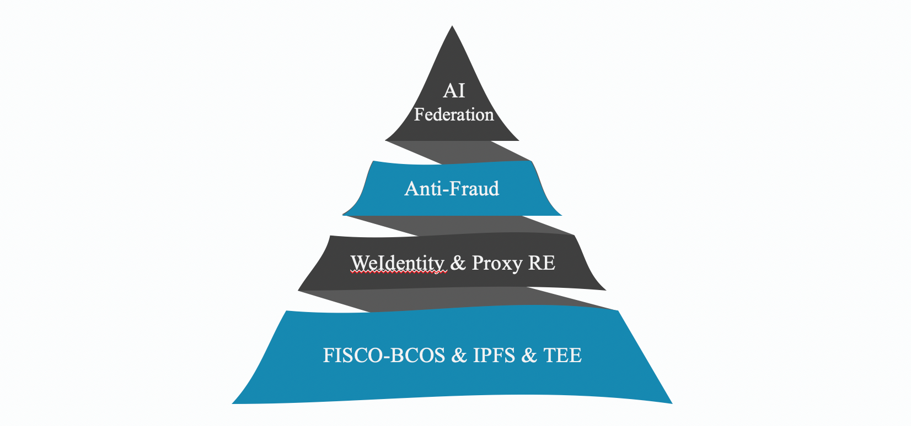
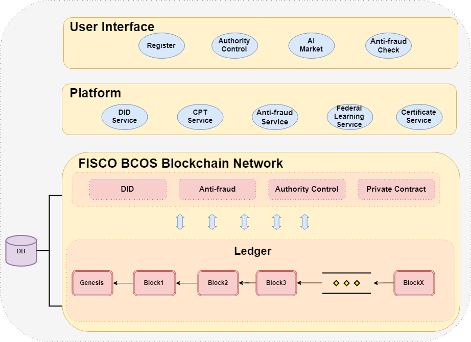

# DeFiDefender

基于分布式身份的微贷联合风控平台

## 项目背景

金融的核心是风控。近年来互联网金融科技的爆发，特别是网络信贷业务的快速增长，一方面降低了金融领域的信息不对称性，推动了普惠金融的发展，另一方面也滋生了诸多新型的欺诈手段，金融欺诈风险不断升级。在征信体系和数字身份体系不健全的背景下，用户逾期率、多头借贷率不断攀升，身份冒用和团伙欺诈等黑产问题频出，严重威胁了借贷平台的运营。不同借贷主体出于商业竞争关系等因素各自为营，无法共享彼此的客户信用数据，导致共债问题比较明显，一个用户可能在多家机构借贷，使得风险积累。即使客户集可以被共享，特征数据的质量和来源也无法得到有效的验证，这限制了借贷平台的风险刻画和个性化定价能力(如利率)。更为关键的是，用户隐私保护和身份主权意识逐渐觉醒，相关法案和协议也正在推行(例如欧洲隐私条例GDPR和W3C DID身份标准)，揭示了未来机构间共享用户数据的难度。

为了在隐私合规的情况下实现多平台数据的互联互通，建立反欺诈联合数据库，分布式身份体系的引入是至关重要的。本项目将基于FISCO BCOS、WeIdentity和代理重加密技术，构建可多方验证的用户自主身份，保证相关数据的隐私存储、授权共享和可信溯源，并以现金贷的贷前身份识别和风险管理作为切入点，探讨新技术背景下的借贷反欺诈联合模型。

## 产品设计

在该项目中，WeIdentity用以实现分布式身份管理、电子凭证发行和验证，从而引入权威机构来标识借款人的数字身份，并支持凭证信息的选择性披露；代理重加密(Proxy Re-encryption)用以支持分布式密钥管理，联合IPFS构建密文云，实现身份凭证的隐私存储和分享；FISCO BCOS联盟链用以支持凭证数据的存证和授权流通，并维护行业欺诈库。

借款人可最小化隐私泄漏，如在保留权威机构签名可验证的情况下，隐藏身份证凭证和银行流水凭证上的姓名字段。通常情况下，用户会尽可能快地将权威机构颁发的凭证存证上链，经由合约检测判断该存证未被预先上链，这样可以确保身份凭证的主权。具体的凭证数据加密后存入存储系统，分享时分发重加密钥匙即可。借贷平台也无需为了防止身份冒用和信息造假而过度采集客户资料，可通过对比借款人提供的身份标识(WeIdentity DID)及身份凭证(WeIdentity Credential，包含权威机构的签名)和链上的凭证哈希及存证的签名方(signer)，来快速验证凭证已被权威机构和借贷发起人所签名，该过程可在链下进行。一种比较极端的情况是，恶意分子截取了刚颁发的凭证并提前将其上链，随后就可以仿冒用户身份进行借贷。为了避免这种情况，一种解决方案是在凭证的声明(claim)里增加身份标识字段，由权威机构认证该凭证属于特定的DID，在借贷时要求用户必须揭示该字段。

此外，为了准确识别多头借贷行为，共享多方黑名单，需要统一的用户身份标识符，也可以采用以上方案。在欺诈行为发生时，例如逾期多个月，平台可通过DID向权威机构查询，从而追溯到现实的个人主体，并将相关恶意行为上链，形成行业反欺诈库。该项目还将设计反多头借贷查询接口，通过输入具体的身份标识符来查询该用户在多少平台上发生过多少金额的借贷行为。考虑到链上数据透明性所带来的隐私限制，借贷行为往往发生在链下，而不是由合约控制，各借贷平台的数据沉淀行为将无可避免。这种情况下，要建立联盟内借贷平台间的互信，关键在于安全多方计算(MPC)，即在各平台不泄漏自己持有信息的同时，又能协同执行某个计算任务。具体地，在不透露各平台的用户凭证集下，计算任务可以定义为：统计某个标示符在所有平台的凭证数据中的出现次数和相应金额，并验证凭证是由权威机构所颁发。MPC的性能在近几年已经得到了显著提升，但当前的工程实践还是围绕安全两方计算(计算时间大约为明文十倍计算水平)，多方计算的通信复杂度较大。尽管我们认为对于简单的安全多方统计任务是可以专门设计电路来保证可用的性能，但本次参赛我们先采用了同态加密来走通流程：当借贷平台A输入身份标识符查询时，会先对标识符加密，再分别发送给借贷平台B、C、D等，各平台也会将自己沉淀的凭证数据转为加密形式，二者将在密文形式下进行匹配；这样不会泄漏A待查询的新用户，其他平台的数据也不用出本地计算，缺点在于A查询次数多了后可能会掌握其他平台的统计规律，即用户集，为此也需要制定适当的数据贡献激励。

除了身份验证和反欺诈外，借贷平台也需要对用户进行风险定价，从而给出个性化的利率。实际的限制是，单平台所拥有的客户信用数据集的规模往往较小，此时可以通过平台级的联邦学习来训练联合风险定价模型，把模型带到数据侧。最后，随着layer2隐私计算公链的技术发展(例如Enigma结合TEE实现了隐私合约的隐私状态存储)，借贷行为和各平台的风控规则也将可以部署为隐私合约，由合约自动给出通过、不通过、升费率、记录恶意名单等等选择。平台的数据沉淀行为将可以避免，真正实现用户DID控制下的身份主权。届时，用户级/边缘级的联邦学习将在构造隐私保护的数据市场上发挥至关重要的作用。

图1: 一种可能的技术路径

ps: 我们在北京DoraHacks大赛中获得了微众分赛道的最佳创意奖，比赛期间已经成功实现了链下代理重加密/联邦学习和链上存证/权限管理的对接，并完成了医疗数据市场/AI市场的demo。同时团队的两位同学也分别是身份项目Blockstack和隐私计算项目Enigma在中国区的技术大使。这次金融科技大赛会更多侧重于WeIdentity同代理重加密的整合，实现自主身份及其数据的分布式密钥管理，也会花更多时间将整套系统有效适配到借贷场景下，实现贷前身份管理和反欺诈。

## 功能描述

1. 注册DID：生成用户、借贷平台、权威机构的DID并注册到FISCO-BCOS链上，设置相关属性；
2. 注册授权机构：把生成好的DID注册成授权机构，信息登记在链上；
3. 注册CPT：生成身份证CPT模版和银行流水CPT模版(claim带DID属性)，信息登记在链上；
4. 链下生成凭证：借贷用户向公安局和银行申请身份证凭证和银行流水凭证，附带自己的DID标识符由授权机构签名；
5. 匿名凭证生成：用户可以选择隐藏claim里的部分字段，如姓名，选择性披露并生成新的凭证；
6. 凭证存证上链/密文存储：用户将凭证哈希后存证上链，再用私钥加密凭证存入IPFS，密文索引写入DID服务端口;
7. 用户发起借贷：用户根据借贷平台公钥和自己私钥生成重加密钥匙，并将其同凭证密文索引地址(链上也有)发给平台方；
8. 平台校验身份：平台用重加密钥匙解开凭证内容，验证存证哈希、授权机构的签名和用户claim的DID(链上有signer)；
9. 平台反欺诈查询：平台可调用反欺诈接口，将借贷用户标示符加密后发给其他平台，隐私保护下(FHE)返回多头借贷详情；
10. 行业欺诈库维护：平台可以将虚假恶意的借贷行为上链，维护链上黑名单，并联合授权机构追溯DID对应的现实实体；
11. 联邦数据/AI市场：平台间的联合建模，联邦学习可在数据不出企业下传输计算图和梯度(Syft，我们实现了联邦数据集)；
12. 借贷隐私合约：在时间允许下，采用Enigma二层隐私计算网络为借贷企业部署隐私合约，FISCO-BCOS做计算步骤的存证。

## 应用场景

如前所述，本项目希望在确保平台数据及用户隐私安全的前提下，通过联盟链、分布式身份、密文云存储、隐私计算和联邦学习等多项技术，在数据验证和计算层面实现借贷行业的互联互通，并为各平台提供贷前身份认证(防范虚假信息和身份冒用)、反欺诈(反多头借贷)、可信数据溯源、AI风险定价等风控服务。我们认为该方案具有很好的可移植性，各项技术在物联网和医疗行业也具有广阔的应用场景。

## 技术架构

### 架构图

### 交互流程

1. 分布式身份： DID注册、授权机构注册、凭证发行、匿名凭证、凭证存证上链、凭证哈希验证，可以不画图直接说参考了WeIdentity请见它们文档。Ps: 但是有一些不同的地方可以画画图，比如在claim里加了DID公钥匙字段，那么在借贷平台验证身份和凭证的环节，就要查询链下生成的凭证是否跟链上存证的匹配，以及该DID公钥是否跟链上存证方的signer匹配。
2. 密文云共享：用Nucypher的重加密方法，借贷人用私钥对凭证加密，再存入IPFS得到密文(cflag)的索引地址；借贷人分享给平台A时，用A的公钥和自己私钥得到重加密钥匙；借贷平台根据收到的重加密钥匙和索引地址，配合自己的私钥解密得到内容；
3. 反欺诈模块：多头借贷时，平台B收到A要查询的标识符密文后，也对自己本地的标示符集进行加密，用同态加密给出是否有多头借贷行为和具体金额；行业反欺诈数据库维护时，可以将逾期用户的行为上链，记录下DID，并告知权威机构也将该DID对应的所有未披露的真实信息上链；
4. 联邦数据/AI市场：借贷平台可以在自己平台用户的授权下，将数据的脱敏字段挂在链上。我们项目也提供联邦学习套件，如果有AI科学家来使用了，相应的用户和平台都可以分成。